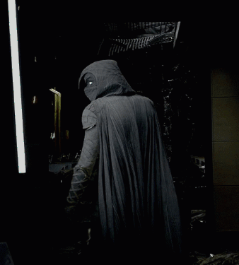

<!-- 💫 README Profil untuk HanzzKT 💫 -->

<!-- ANIMASI NAMA -->

  

<!-- WAVE SEPARATOR -->

  

<!-- 🌙 ABOUT ME SECTION WITH BREATHING MOONLIGHT -->
<h2 align="center">🌙 About Me</h2>

  <table>
    <tr>
      <!-- TEKS KIRI -->
      <td style="width: 55%; vertical-align: top;">
        

          👋 Halo, aku <b>Hanzz</b> — seorang pengembang yang suka menulis kode di bawah cahaya bulan.  
          Aku menjelajahi dunia <b>web development</b> mulai dari <b>HTML, CSS, JavaScript, Laravel, React</b>, hingga <b>Next.js</b>.  
          Setiap baris kode bagiku adalah <i>cahaya kecil</i> yang menembus kegelapan digital.  
            
          🌌 <i>Code in darkness, conquer in light.</i>
        

      </td>

      <!-- GIF KANAN -->
      <td style="width: 45%; text-align: center;">
        

          
          <!-- Aura cahaya bulan -->
          

        

      </td>
    </tr>
  </table>

<!-- 🌕 BREATHING MOONLIGHT ANIMATION -->

---

<!-- ⚙️ TECH STACK -->
<h2 align="center">⚙️ Tech Stack</h2>

  

---

<!-- 📊 GITHUB STATS -->
<h2 align="center">📊 GitHub Stats</h2>

  
  

---

<!-- 🌌 QUOTE / FOOTER -->

  

  “Even in darkness, the moon keeps glowing — so do I.”

